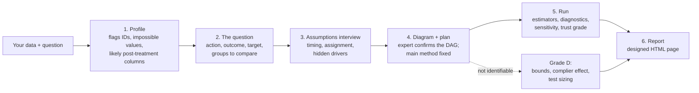

# causal-analyst

**Causal analysis for people who aren't data scientists.** An [Agent Skill](https://docs.claude.com/en/docs/agents-and-tools/agent-skills/overview) that lets Claude answer "did X actually cause Y?" from your data. It interviews you in plain language, fixes the plan before looking at any results, runs several causal methods side by side, checks how far to trust the answer, and hands back a designed one-page report. When the data can't answer the question, it says so.


<p align="center"><a href="examples/loyalty-program/report.html">Loyalty program report</a> · <a href="examples/sales-calls/report.html">Sales calls report ("can't tell")</a> · <a href="#install">Install</a></p>

---

## Why this exists

Frontier models are already good at the arithmetic of causal inference. Give Claude a clean dataset and the right controls, and it will usually estimate an effect well. In our tests, plain Claude matched the skill on the loyalty case to within a few percent.

What goes wrong in practice is **judgment**, not arithmetic:

- **Controlling for the wrong thing.** "Points redeemed" is a *result* of joining a loyalty program. Adjust for it and a +$10 effect becomes −$22.
- **Answering a question the data can't support.** If sales reps pick whom to call using a gut feel that isn't recorded, no amount of adjustment recovers the effect of a call.
- **Choosing the method after seeing the results**, and quietly drifting toward the answer people hoped for.
- **Overstating certainty.** In testing, plain Claude twice gave confident ranges that missed the true answer. On a benchmark case the data couldn't answer, it said the effect was "almost certainly about −0.27"; the true value was outside its range.

This skill wraps a tested numerical toolkit in a workflow that forces those judgments into the open: controls confirmed as pre-treatment, a causal diagram the expert signs off, a method fixed in advance, an explicit "we can't tell" grade, and sensitivity analysis that sizes the hidden-factor risk.

## What you get

A self-contained HTML report (works offline, on a phone, and prints cleanly) with:

| Section | What it answers |
|---|---|
| Headline + trust grade (A–D) | What's the effect, how sure are we, who gains most |
| Where the raw gap comes from | How much of the naive difference is *who* got the action vs the action itself |
| Methods side by side | Does the answer depend on the technique? |
| Meet the methods | A timeline and plain-English guide to each method family |
| Who benefits more | Effects for the groups you asked about, with ranges |
| Why the grade | Overlap, balance, hidden-factor strength, placebo and stability checks |
| What this rests on | The confirmed causal diagram, and the trap that was avoided |
| Next steps and questions | A sized randomized test, and every assumption made on your behalf |

<table>
<tr>
<td width="50%"></td>
<td width="50%"></td>
</tr>
<tr>
<td></td>
<td></td>
</tr>
</table>

When the question can't be answered, the report leads with that and shows what *can* be said:

<table>
<tr>
<td width="50%"></td>
<td width="50%"></td>
</tr>
</table>

Open the full reports: [loyalty program](examples/loyalty-program/report.html) (grade C) · [sales calls](examples/sales-calls/report.html) (grade D). GitHub shows HTML as source, so download them, or view them through a service like [htmlpreview](https://htmlpreview.github.io/).

## How it works



Two rules hold throughout:

1. **Numbers come from the script, never from the model's head.** `scripts/ca.py` produces every estimate. Claude writes only the words (`narrative.json`), and the report renderer draws every chart from `results.json`.
2. **The plan comes before the results.** The main method, controls and target are written into `spec.json` and approved before anything runs. Other methods are shown as cross-checks, never averaged in.

### The methods

| Family | Methods | Role |
|---|---|---|
| Classical statistics | Linear regression, propensity weighting | Cross-checks; transparent baselines |
| Machine learning with statistical guarantees | **Doubly robust ML (main)**, double ML, causal forest, ML regression, spline-based doubly robust | The main estimate and its closest checks |
| Foundation models *(optional)* | [CausalPFN](https://arxiv.org/abs/2506.07918) (local), doubly robust with [TabPFN](https://priorlabs.ai) (hosted) | Cross-checks only: accurate in tests, but their own ranges run too narrow |

For amount treatments (e.g. discount size), the skill uses g-computation with the outcome model chosen by cross-validation. For "can't tell" cases it reports Manski / Manski–Pepper bounds, or instrument-based bounds and the complier effect when a random nudge exists.

**Diagnostics:** propensity overlap and trimmed estimate; covariate balance before and after weighting; a fake-treatment placebo; a random-common-cause test; 80% subsample stability; Cinelli–Hazlett robustness value against the strongest measured confounder; a "bad control" illustration; power calculations for a confirming experiment.

**Trust grades:** **A** randomized and checks pass · **B** observational, good overlap, robust to moderate hidden bias · **C** a weakness (weak overlap, fragile to hidden bias, methods disagree) · **D** the data can't answer this.

## Install

**Claude apps (claude.ai / desktop):** download `causal-analyst.skill` from [Releases](../../releases) and upload it in Settings, under Skills. Then ask a question with a data file attached. The skill triggers on questions like "did our loyalty program raise spend?"

**Claude Code:** copy `skills/causal-analyst/` into `~/.claude/skills/` (personal) or `.claude/skills/` (project).

**Python dependencies** (installed automatically where the environment allows, otherwise):

```bash
pip install -r requirements.txt                 # core: numpy, pandas, scikit-learn, statsmodels, econml, dowhy, matplotlib
pip install -r requirements-optional.txt        # optional: CausalPFN (local), tabpfn-client (hosted)
```

### Running the toolkit without an agent

The scripts are a plain CLI, so you can reproduce any report by hand:

```bash
cd examples/loyalty-program
S=../../skills/causal-analyst/scripts
python $S/ca.py profile  --data data.csv --treatment joined_loyalty --outcome monthly_spend --out profile.json
python $S/ca.py dag      spec.json --outdir .
python $S/ca.py identify spec.json --out identification.json
python $S/ca.py run      spec.json --out results.json      # ~1 minute on 4,000 rows
python $S/ca.py report   results.json --narrative narrative.json --out report.html
python $S/ca.py power    --sd 31 --lift 5 --results results.json
```

## Which model to run it on

| Model | Status |
|---|---|
| **Claude Opus 5.5** | **Tested.** Every evaluation in this repo was run on it. Recommended for real decisions. |
| Other Claude models (Sonnet, Haiku) | Should work, but not yet evaluated. The scripts do the numerical work, but the steps that matter most are judgment calls: spotting post-treatment columns, deciding identification, calibrated wording. Run [`evals/`](evals/) before relying on a smaller model. |
| Non-Claude agents (e.g. GPT-6 Astra in a tool that reads `SKILL.md`, or any agent with a shell) | Not tested. `SKILL.md` is plain Markdown and the toolkit is a Python CLI, so any agent that can read instructions and run Python can drive it. Please share eval results if you try. |

The model matters less for the numbers (they're scripted) and more for knowing when *not* to trust them. That is where we'd spend on the strongest model available.

## Evidence

We ran the [skill-creator](https://github.com/anthropics/skills) eval loop on three scenarios, comparing Claude with the skill against Claude with the same prompt and no skill ([details](evals/README.md)):

| Scenario | True answer | With skill | Without skill |
|---|---|---|---|
| Loyalty program with a post-treatment trap | +$9.17 | +$9.25 (7.43–11.07), grade C, trap excluded | +$9.50 (8.3–10.7), trap excluded, no grade |
| Benchmark case with an unmeasured confounder (not identifiable) | null | null; bounds −0.295 to −0.214 contain the truth | null; bounds −0.281 to −0.261 **miss** the truth |
| Sales calls chosen on an unrecorded "gut feel" | ≈ +5 per 100 | grade D; 0–25 per 100 contains the truth; test sized | no headline; "6 to 16 per 100" **misses** the truth |

Assertion pass rate: **100% with the skill vs 50–57% without**, at about 2–3 minutes and ~20% more tokens per run. Accuracy on clean cases is similar either way. The difference is honest ranges, abstention, pre-registration, and a report someone can act on.

The foundation-model cross-checks were benchmarked on 14 semi-synthetic datasets ([results](evals/foundation-models/)):

| | Average error | 95% range covers truth | Time (CPU, 2–5k rows) |
|---|---|---|---|
| Doubly robust ML (main) | 5.2% | 14 / 14 | ~4 s |
| CausalPFN | 2.8% | 12 / 14 | ~25–55 s |
| Doubly robust with CausalPFN outcomes | 4.1% | 13 / 14 | ~25–55 s |

CausalPFN was more accurate, especially under poor overlap, but overconfident. That is why the main method stays classical-ML and the foundation models are cross-checks.

## Data and privacy

- Everything runs locally by default. **No data leaves your machine** unless you opt in.
- The hosted TabPFN cross-check sends data to Prior Labs. It runs only when the analysis plan lists `"allow_external_services": ["tabpfn_api"]`, which the skill sets only after you agree. Its upload also needs `api.priorlabs.ai` and `storage.googleapis.com` reachable.
- API keys are read from `TABPFN_TOKEN` or a file named by `TABPFN_TOKEN_FILE`. Never paste keys into chat.
- CausalPFN weights (~75 MB) download from Hugging Face on first use, or point `CAUSALPFN_WEIGHTS` at a local copy.

## Limitations

- **One yes/no or amount action at a time**, cross-sectional data. Difference-in-differences, regression discontinuity and multi-valued actions are not automated yet (the skill says so and offers a labelled one-off analysis).
- **Hidden confounding can be sized, not removed.** Grades B and C still rest on "nothing important is missing". The report says exactly how strong a hidden factor would need to be.
- **Front-door identification** is detected but not estimated in this version.
- **Size:** comfortable up to a few hundred thousand rows on a laptop. Larger tables are what the warehouse version (below) is for.
- **Tested on synthetic and semi-synthetic data** with known answers, plus one benchmark case. Real-world validation is ongoing.

## Roadmap

- **SQL / warehouse layer:** a signed-off analysis becomes a versioned contract; models are fitted on a schedule in Databricks, Snowflake or ClickHouse; effects are answered in SQL in seconds, with the trust grade recomputed per query.
- Difference-in-differences and synthetic control for before/after rollouts; regression discontinuity for score cutoffs.
- A proper one-step correction for foundation-model cross-checks ([Melnychuk et al., 2026](https://arxiv.org/abs/2603.12037)), and GPU support.
- Broader evals, including real-world benchmarks such as CausalReasoningBenchmark.

## Repository layout

```
skills/causal-analyst/     the skill: SKILL.md, scripts/, references/
examples/                  two worked cases: data, brief, spec, results, narrative, report
evals/                     eval scenarios, assertions, benchmark results, foundation-model study
tests/                     smoke test (runs the full pipeline on the loyalty example)
docs/images/               screenshots used in this README
```

## Credits

Built on [DoWhy](https://github.com/py-why/dowhy) (identification cross-check), [EconML](https://github.com/py-why/EconML) (double ML, causal forests), [scikit-learn](https://scikit-learn.org), [statsmodels](https://www.statsmodels.org), and optionally [CausalPFN](https://arxiv.org/abs/2506.07918) and [TabPFN](https://github.com/PriorLabs/tabpfn-client). Methods: Robins, Rotnitzky & Zhao (1994); Chernozhukov et al. (2018); Wager & Athey (2018); Cinelli & Hazlett (2020); Manski (1990); Manski & Pepper (2000); Balazadeh et al. (2025); Hollmann et al. (2025).

See [CITATION.cff](CITATION.cff) to cite this project. Licensed under [Apache-2.0](LICENSE).
