# causal-analyst

**Causal analysis for people who aren't data scientists.** An [Agent Skill](https://docs.claude.com/en/docs/agents-and-tools/agent-skills/overview) that lets Claude answer "did X actually cause Y?" from your data. You bring the question and what you know about your business. Claude does the modelling, checks how far to trust the answer, and hands back a one-page report. When the data can't answer the question, it says so.

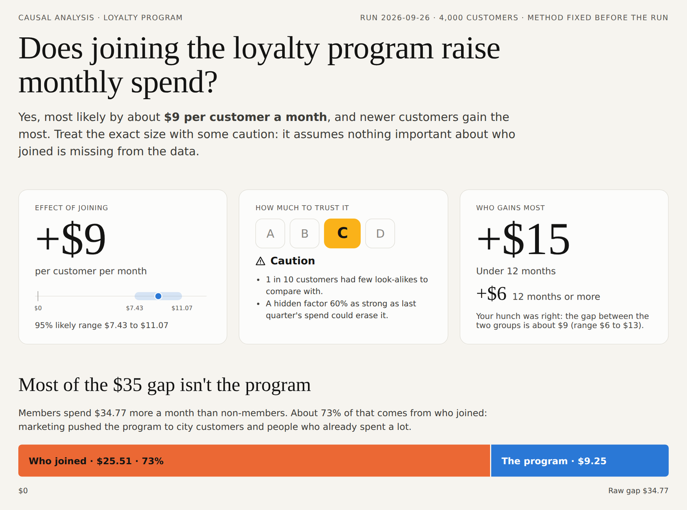

<p align="center"><b>Live example reports:</b> <a href="https://htmlpreview.github.io/?https://github.com/kiritbasu/causal-analyst/blob/main/examples/loyalty-program/report.html">Loyalty program</a> (grade C) · <a href="https://htmlpreview.github.io/?https://github.com/kiritbasu/causal-analyst/blob/main/examples/sales-calls/report.html">Sales calls</a> (grade D, "can't tell") · <a href="#quick-start">Quick start</a></p>

**Contents:** [Why this exists](#why-this-exists) · [What it's like to use](#what-its-like-to-use) · [The report](#the-report) · [Quick start](#quick-start) · [How it works](#how-it-works) · [Does it work?](#does-it-work) · [Which model to use](#which-model-to-use) · [Data and privacy](#data-and-privacy) · [Limitations and roadmap](#limitations-and-roadmap)

---

## Why this exists

Good causal analysis needs two kinds of knowledge that rarely sit in one person:

- **Data science:** which methods to use, how to check them, and what the numbers can and can't support.
- **Domain knowledge:** what happened before what, how people ended up getting the treatment, and what important factor isn't in the data.

The marketing lead knows that "points redeemed" only exists *after* someone joins, and that the program was pushed to big spenders. The data scientist knows that controlling for points will wreck the estimate, and that targeting big spenders creates a gap that isn't the program's doing. Usually it takes both people and a lot of back and forth. Often the domain expert simply ends up with a correlation.

**This skill lets the domain expert work directly with Claude.** Claude handles the modelling. It asks, in plain language, only the questions that need domain knowledge, turns the answers into a causal diagram the expert confirms, then runs and checks the analysis and explains the result. The expert supplies what only they know; the skill supplies the rest.

It also guards against the ways capable models go wrong. Frontier models already get the arithmetic right: in our tests plain Claude matched the skill's estimate on a clean case to within a few percent. The failures are judgment calls:

- **Controlling for the wrong thing.** Adjusting for "points redeemed" turns a +$10 effect into −$22.
- **Answering a question the data can't support.** If reps pick whom to call using a gut feel that isn't recorded, no amount of adjustment recovers the effect of a call.
- **Choosing the method after seeing the results**, and quietly drifting toward the hoped-for answer.
- **Overstating certainty.** Plain Claude twice gave confident ranges that missed the true answer.

So the workflow puts those judgments in the open. Controls are confirmed as recorded before the treatment. The expert signs off the diagram. The method is fixed in advance. There's an explicit "we can't tell" grade, and the risk from hidden factors is sized.

## What it's like to use

You attach a file and ask in your own words. The skill takes it from there, stopping three times for your input.

> **You:** *[attaches customers.csv]* Did our loyalty program actually raise monthly spend? We think newer customers benefit more.

**1. Claude checks the data** and points out anything odd before going further:

> 4,000 customers, 9 columns. `points_redeemed` almost perfectly predicts who joined, which usually means it's a *result* of joining. And 44% of non-members have some points, which shouldn't happen. I'll flag that.

**2. It asks what only you know**, one question at a time, as clickable options:

> Were income, tenure, age, city and last quarter's spend all recorded *before* customers joined? ○ Yes ○ Some were later ○ Not sure
>
> Is there anything that affects both who joins and how much they spend that isn't in this file? ○ No ○ Yes: ___ ○ Not sure

**3. You confirm the diagram and the plan.** Claude draws how it thinks things work, you correct it, and the main method is fixed before anything runs.

**4. You get the report** about a minute later. It gives the answer, how much to trust it and why, who benefits most, and the randomized test that would settle it.

## The report

A self-contained HTML page: it works offline, on a phone, and prints cleanly. It reads top to bottom as a story. Here is the answer; here is what it stood on; here is how sure we are; here is what to do.

| # | Section | What it answers |
|---|---|---|
| 1 | Headline + trust grade (A–D) | What's the effect, how sure are we, who gains most |
| 2 | The data | How big it is, each column's role (action, outcome, control, left out), distributions, the first few rows |
| 3 | How we think it works | The causal diagram, in a picture and in words, and whether you confirmed it |
| 4 | Where the raw gap comes from | How much of the naive difference is *who* got the action vs the action itself |
| 5 | Methods side by side | Does the answer depend on the technique? |
| 6 | Meet the methods | A timeline and plain-English guide to each method family |
| 7 | Who benefits more | Effects for the groups you asked about, with ranges |
| 8 | Why the grade | Overlap, balance, hidden-factor strength, placebo and stability checks |
| 9 | What this rests on | Every assumption and its status; the trap that was avoided; data issues |
| 10 | Next steps and questions | A sized randomized test, and every assumption made on your behalf |

<table>
<tr>
<td width="50%"><b>2 · The data</b><br>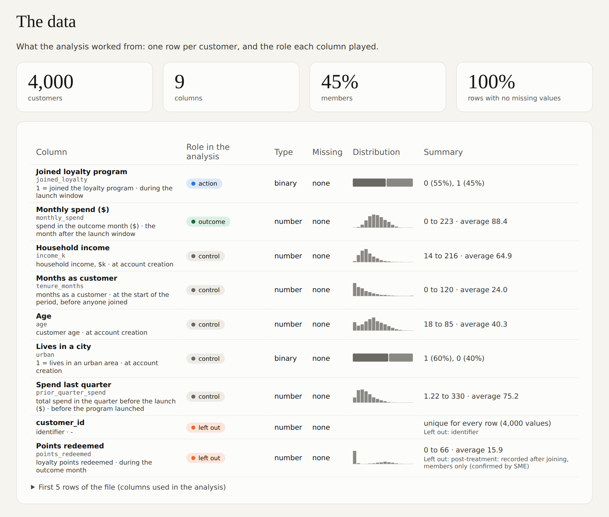</td>
<td width="50%"><b>3 · How we think it works</b><br>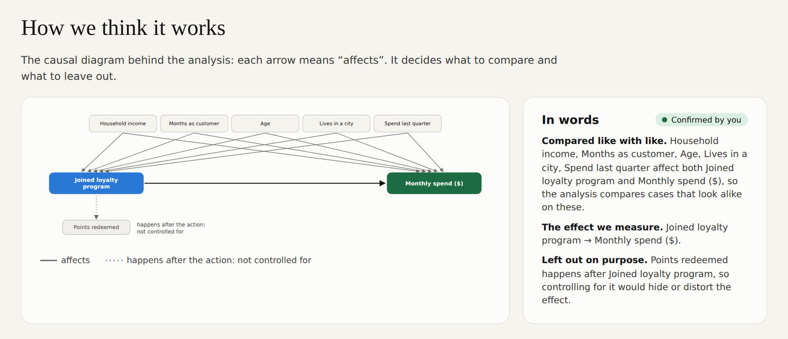</td>
</tr>
<tr>
<td><b>4 · Where the raw gap comes from</b><br>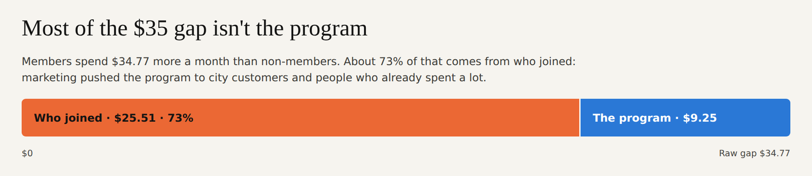<br><b>7 · Who benefits more</b><br>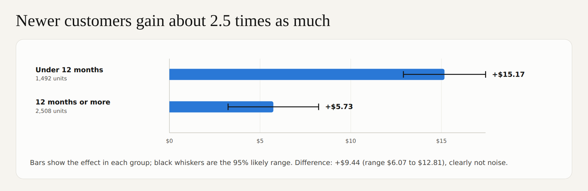</td>
<td><b>5 · Methods side by side</b><br>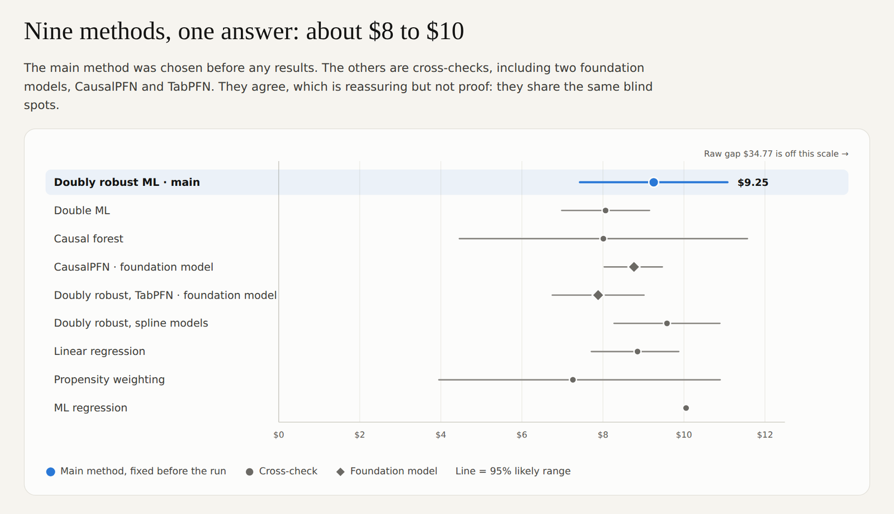</td>
</tr>
<tr>
<td><b>6 · Meet the methods</b><br>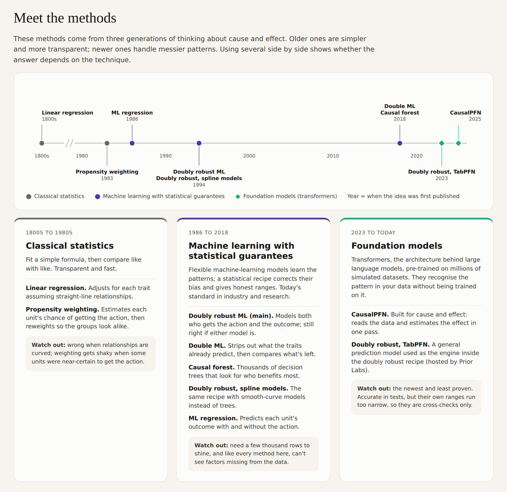</td>
<td><b>8 · Why the grade</b><br>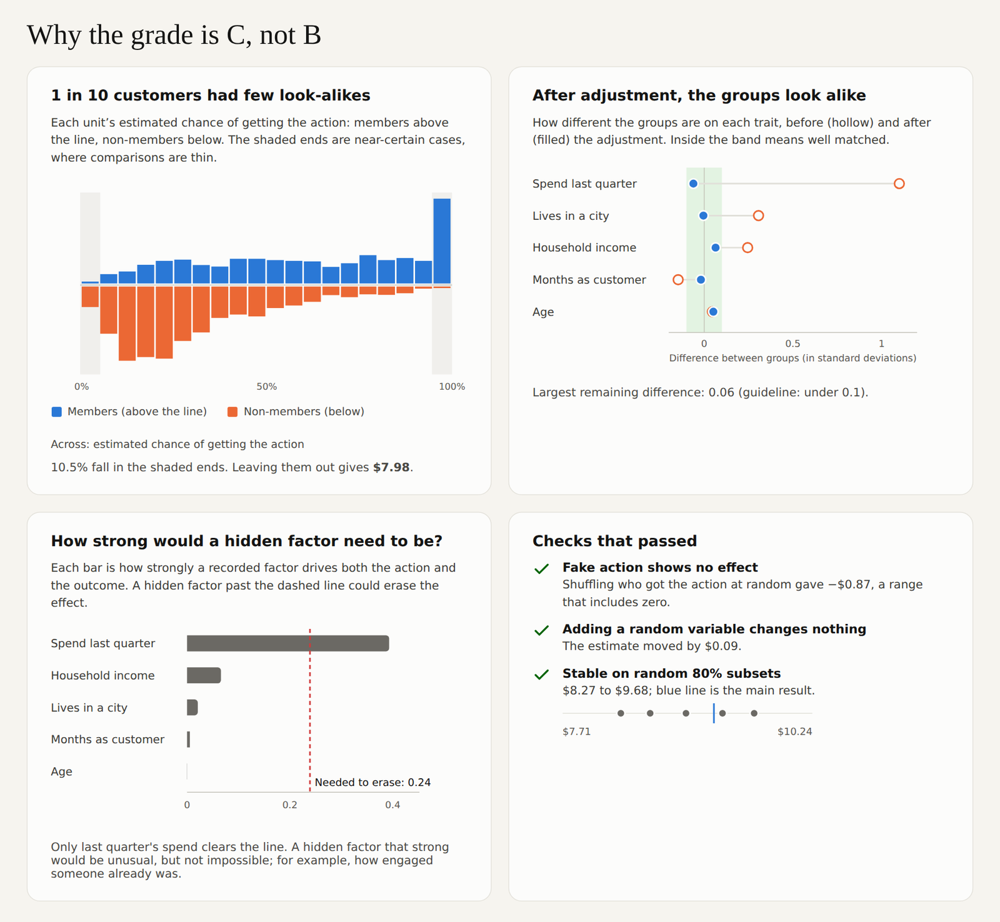</td>
</tr>
<tr>
<td><b>9 · What this rests on</b><br>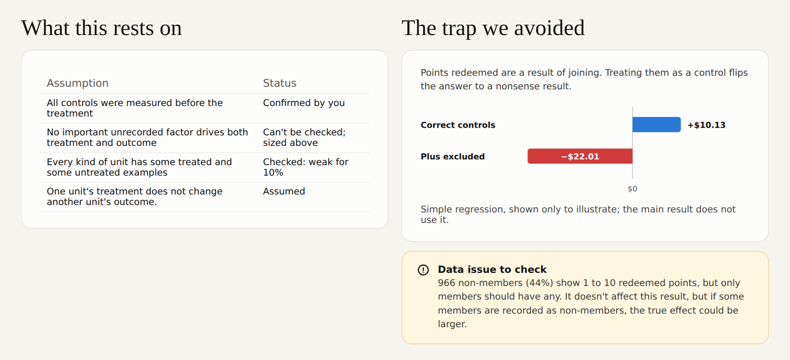</td>
<td><b>10 · Next steps and questions</b><br>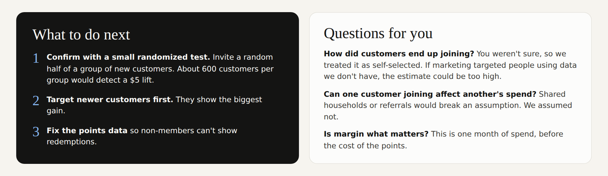</td>
</tr>
</table>

**When the data can't answer the question**, the report leads with that. The diagram shows why, and the page gives what *can* be said: a range the true effect lies in, and how to find out.

<table>
<tr>
<td width="33%">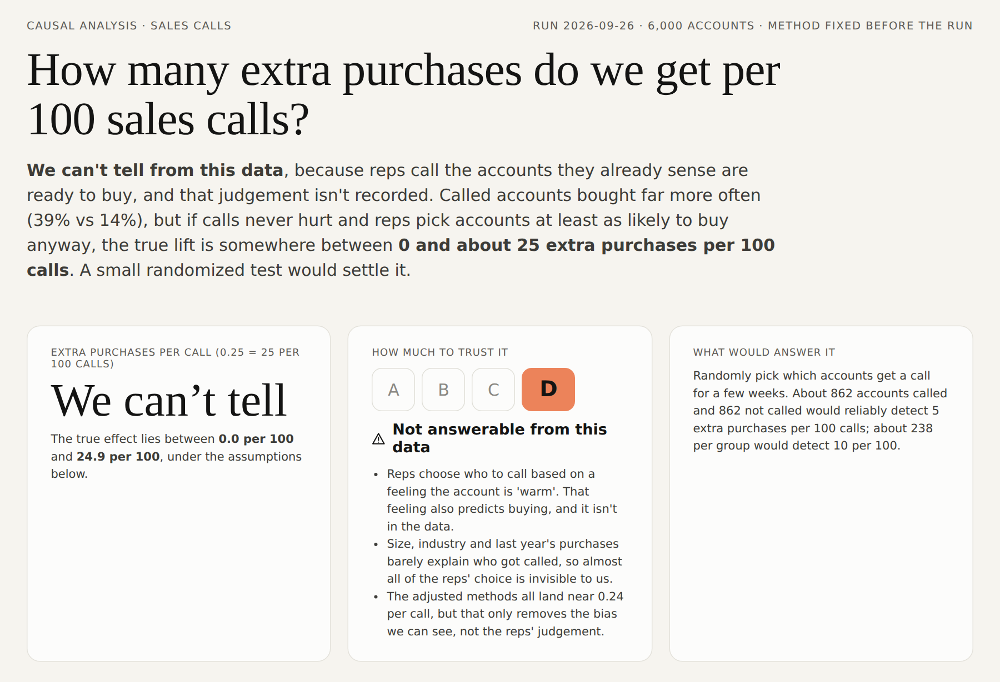</td>
<td width="33%">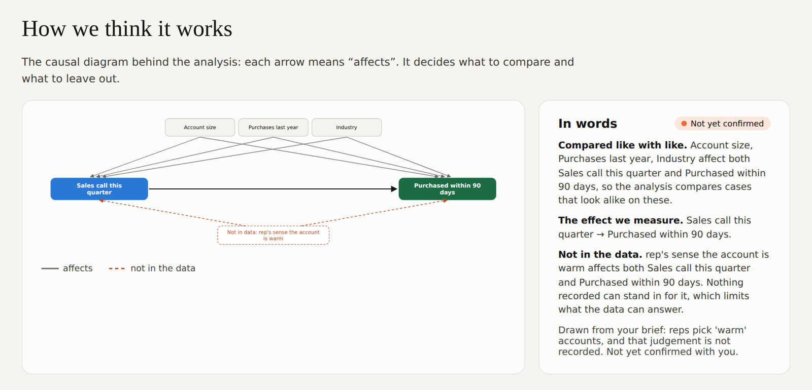</td>
<td width="33%">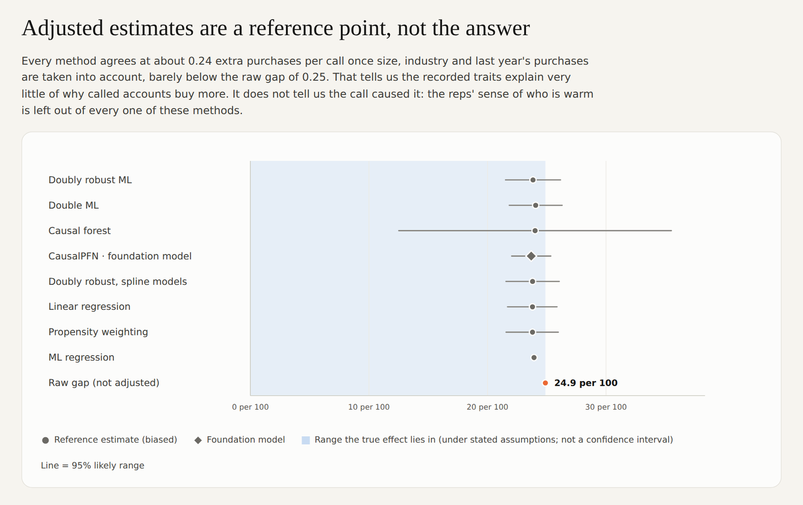</td>
</tr>
</table>

**Open the full reports:** [loyalty program](https://htmlpreview.github.io/?https://github.com/kiritbasu/causal-analyst/blob/main/examples/loyalty-program/report.html) (grade C) · [sales calls](https://htmlpreview.github.io/?https://github.com/kiritbasu/causal-analyst/blob/main/examples/sales-calls/report.html) (grade D). The HTML files, data and every intermediate file are in [`examples/`](examples/).

## Quick start

**Claude apps (claude.ai / desktop):** download `causal-analyst.skill` from [Releases](../../releases) and upload it in Settings, under Skills. Then attach a data file and ask your question. The skill triggers on questions like "did our loyalty program raise spend?" or "is this cause or just coincidence?"

**Claude Code:** copy `skills/causal-analyst/` into `~/.claude/skills/` (personal) or `.claude/skills/` (project).

**Python dependencies** are installed automatically where the environment allows. Otherwise:

```bash
pip install -r requirements.txt            # core: numpy, pandas, scikit-learn, statsmodels, econml, dowhy, matplotlib
pip install -r requirements-optional.txt   # optional: CausalPFN (local), tabpfn-client (hosted)
```

**Without an agent:** the toolkit is a plain CLI, so you can reproduce any report by hand:

```bash
cd examples/loyalty-program
S=../../skills/causal-analyst/scripts
python $S/ca.py profile  --data data.csv --treatment joined_loyalty --outcome monthly_spend --out profile.json
python $S/ca.py dag      spec.json --outdir .
python $S/ca.py identify spec.json --out identification.json
python $S/ca.py run      spec.json --out results.json      # ~1 minute on 4,000 rows
python $S/ca.py power    --sd 31 --lift 5 --results results.json
python $S/ca.py report   results.json --narrative narrative.json --out report.html
```

## How it works

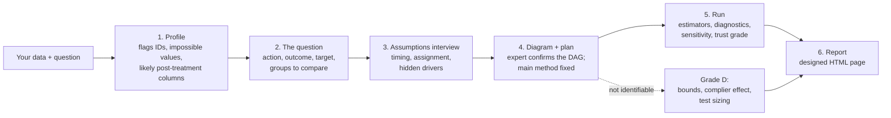

Two rules hold throughout:

1. **Numbers come from the script, never from the model's head.** `scripts/ca.py` produces every estimate. Claude writes only the words (`narrative.json`), and the report renderer draws every chart from `results.json`.
2. **The plan comes before the results.** The main method, controls and target are written into `spec.json` and approved before anything runs. Other methods are shown as cross-checks, never averaged in.

**The methods**

| Family | Methods | Role |
|---|---|---|
| Classical statistics | Linear regression, propensity weighting | Cross-checks; transparent baselines |
| Machine learning with statistical guarantees | **Doubly robust ML (main)**, double ML, causal forest, ML regression, spline-based doubly robust | The main estimate and its closest checks |
| Foundation models *(optional)* | [CausalPFN](https://arxiv.org/abs/2506.07918) (local), doubly robust with [TabPFN](https://priorlabs.ai) (hosted) | Cross-checks only: accurate in tests, but their own ranges run too narrow |

For amount treatments (e.g. discount size), the skill uses g-computation with the outcome model chosen by cross-validation. For "can't tell" cases it reports Manski / Manski–Pepper bounds, or instrument-based bounds and the complier effect when a random nudge exists.

**Diagnostics:**
- propensity overlap, with a trimmed estimate;
- covariate balance before and after weighting;
- a fake-treatment placebo and a random-common-cause test;
- stability across 80% subsamples;
- the Cinelli–Hazlett robustness value against the strongest measured confounder;
- a "bad control" illustration;
- power calculations for a confirming experiment.

**Trust grades:** **A** randomized and checks pass · **B** observational, good overlap, robust to moderate hidden bias · **C** a weakness (weak overlap, fragile to hidden bias, methods disagree) · **D** the data can't answer this.

## Does it work?

We ran the [skill-creator](https://github.com/anthropics/skills) eval loop on three scenarios, comparing Claude with the skill against Claude with the same prompt and no skill ([details](evals/README.md)):

| Scenario | True answer | With skill | Without skill |
|---|---|---|---|
| Loyalty program with a post-treatment trap | +$9.17 | +$9.25 (7.43–11.07), grade C, trap excluded | +$9.50 (8.3–10.7), trap excluded, no grade |
| Benchmark case with an unmeasured confounder (not identifiable) | null | null; bounds −0.295 to −0.214 contain the truth | null; bounds −0.281 to −0.261 **miss** the truth |
| Sales calls chosen on an unrecorded "gut feel" | ≈ +5 per 100 | grade D; 0–25 per 100 contains the truth; test sized | no headline; "6 to 16 per 100" **misses** the truth |

Assertion pass rate: **100% with the skill vs 50–57% without**, at about 2–3 minutes and ~20% more tokens per run. Accuracy on clean cases is similar either way. The difference is honest ranges, abstention, pre-registration, and a report someone can act on.

The foundation-model cross-checks were benchmarked on 14 semi-synthetic datasets ([results](evals/foundation-models/)):

| | Average error | 95% range covers truth | Time (CPU, 2–5k rows) |
|---|---|---|---|
| Doubly robust ML (main) | 5.2% | 14 / 14 | ~4 s |
| CausalPFN | 2.8% | 12 / 14 | ~25–55 s |
| Doubly robust with CausalPFN outcomes | 4.1% | 13 / 14 | ~25–55 s |

CausalPFN was more accurate, especially under poor overlap, but overconfident. That is why the main method stays classical-ML and the foundation models are cross-checks.

## Which model to use

| Model | Status |
|---|---|
| **Claude Opus 5.5** | **Tested.** Every evaluation in this repo was run on it. Recommended for real decisions. |
| Other Claude models (Sonnet, Haiku) | Should work, but not yet evaluated. The scripts do the numerical work, but the steps that matter most are judgment calls: spotting post-treatment columns, deciding identification, calibrated wording. Run [`evals/`](evals/) before relying on a smaller model. |
| Non-Claude agents (e.g. GPT-6 Astra in a tool that reads `SKILL.md`, or any agent with a shell) | Not tested. `SKILL.md` is plain Markdown and the toolkit is a Python CLI, so any agent that can read instructions and run Python can drive it. Please share eval results if you try. |

The model matters less for the numbers (they're scripted) and more for knowing when *not* to trust them. That is where we'd spend on the strongest model available.

## Data and privacy

- Everything runs locally by default. **No data leaves your machine** unless you opt in.
- The report includes the first 5 rows of the data so readers can see what the analysis stood on. For personal or sensitive data, set `"report_sample_rows": 0` in the plan.
- The hosted TabPFN cross-check sends data to Prior Labs. It runs only when the analysis plan lists `"allow_external_services": ["tabpfn_api"]`, which the skill sets only after you agree. Its upload also needs `api.priorlabs.ai` and `storage.googleapis.com` reachable.
- API keys are read from `TABPFN_TOKEN` or a file named by `TABPFN_TOKEN_FILE`. Never paste keys into chat.
- CausalPFN weights (~75 MB) download from Hugging Face on first use, or point `CAUSALPFN_WEIGHTS` at a local copy.

## Limitations and roadmap

**Limitations**

- **One yes/no or amount action at a time**, cross-sectional data. Difference-in-differences, regression discontinuity and multi-valued actions are not automated yet (the skill says so and offers a labelled one-off analysis).
- **Hidden confounding can be sized, not removed.** Grades B and C still rest on "nothing important is missing". The report says exactly how strong a hidden factor would need to be.
- **The diagram is only as good as the answers behind it.** If a column's name is misleading and nobody catches it, the diagram, and the answer, will be wrong. That's why the skill asks and the expert confirms.
- **Front-door identification** is detected but not estimated in this version.
- **Size:** comfortable up to a few hundred thousand rows on a laptop. Larger tables are what the warehouse version (below) is for.
- **Tested on synthetic and semi-synthetic data** with known answers, plus one benchmark case. Real-world validation is ongoing.

**Roadmap**

- **SQL / warehouse layer:** a signed-off analysis becomes a versioned contract. Models are fitted on a schedule in Databricks, Snowflake or ClickHouse, and effects are answered in SQL in seconds, with the trust grade recomputed per query.
- **Realistic synthetic datasets for causal inference:** a generator for complex, real-world-like scenarios with a known answer. Think hidden drivers, post-treatment traps, weak overlap, effects that vary by group, rollouts over time, and messy data. Use it to test this skill, compare methods, and train people.
- Difference-in-differences and synthetic control for before/after rollouts; regression discontinuity for score cutoffs.
- A proper one-step correction for foundation-model cross-checks ([Melnychuk et al., 2026](https://arxiv.org/abs/2603.12037)), and GPU support.
- Broader evals, including real-world benchmarks such as CausalReasoningBenchmark.

## Repository layout

```
skills/causal-analyst/     the skill: SKILL.md, scripts/, references/
examples/                  two worked cases: data, brief, spec, results, narrative, report
evals/                     eval scenarios, assertions, benchmark results, foundation-model study
tests/                     smoke test (runs the full pipeline on both examples)
docs/images/               screenshots used in this README
```

Contributions, especially eval results on other models and new test cases with known answers, are welcome: see [CONTRIBUTING](CONTRIBUTING.md).

## Credits and licence

Built on [DoWhy](https://github.com/py-why/dowhy) (identification cross-check), [EconML](https://github.com/py-why/EconML) (double ML, causal forests), [scikit-learn](https://scikit-learn.org), [statsmodels](https://www.statsmodels.org), and optionally [CausalPFN](https://arxiv.org/abs/2506.07918) and [TabPFN](https://github.com/PriorLabs/tabpfn-client). Methods: Robins, Rotnitzky & Zhao (1994); Chernozhukov et al. (2018); Wager & Athey (2018); Cinelli & Hazlett (2020); Manski (1990); Manski & Pepper (2000); Balazadeh et al. (2025); Hollmann et al. (2025).

See [CITATION.cff](CITATION.cff) to cite this project. Licensed under [Apache-2.0](LICENSE).
