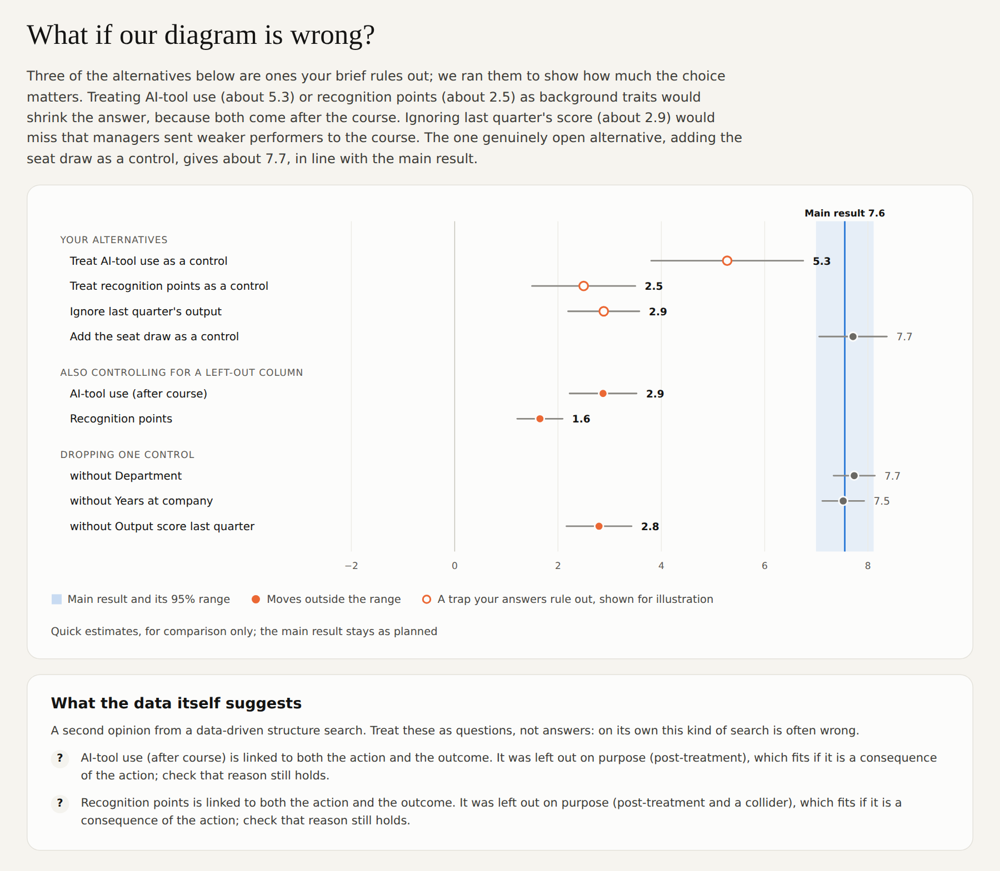
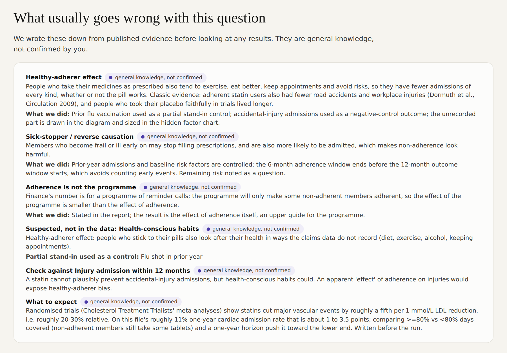
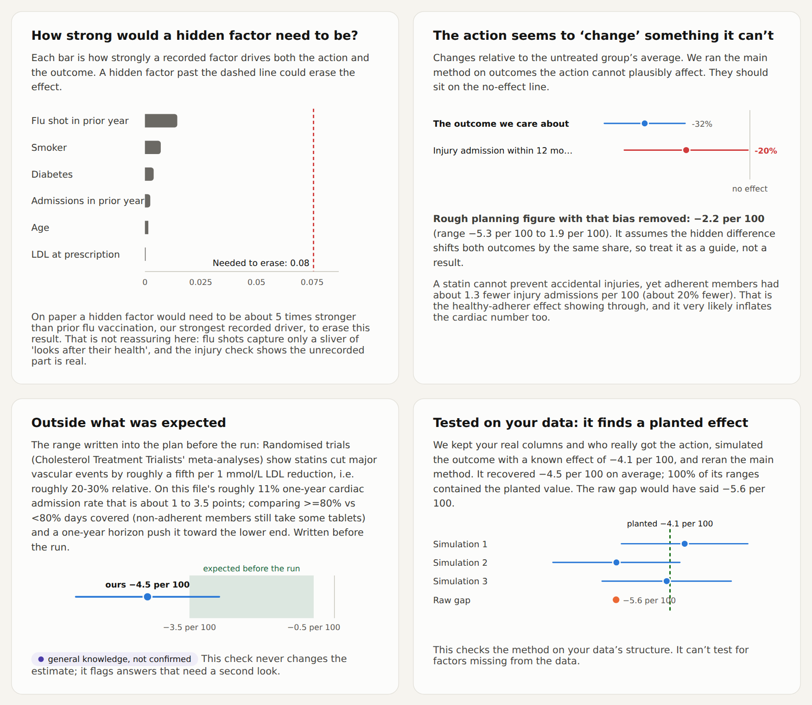
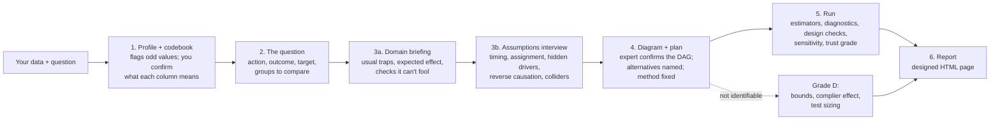

# causal-analyst

[](https://github.com/kiritbasu/causal-analyst/actions/workflows/test.yml) [](https://github.com/kiritbasu/causal-analyst/releases) [](LICENSE)

**Causal analysis without the guesswork.** A step-by-step way to answer "did X cause Y?" from your data, packaged as an [Agent Skill](https://docs.claude.com/en/docs/agents-and-tools/agent-skills/overview) for Claude. It asks the questions a good analyst would ask, builds the model, and grades the answer from A to D so you know how far to rely on it.


<p align="center"><sub>The loyalty example is synthetic data with a known true effect (+$9.17 a month), so you can check the answer yourself.</sub></p>

<p align="center"><b>Live example reports:</b> <a href="https://htmlpreview.github.io/?https://github.com/kiritbasu/causal-analyst/blob/main/examples/loyalty-program/report.html">Loyalty program</a> (grade C) · <a href="https://htmlpreview.github.io/?https://github.com/kiritbasu/causal-analyst/blob/main/examples/sales-calls/report.html">Sales calls</a> (grade D, "can't tell") · <a href="https://htmlpreview.github.io/?https://github.com/kiritbasu/causal-analyst/blob/main/examples/ai-training/report.html">AI training</a> (grade B, three traps) · <a href="https://htmlpreview.github.io/?https://github.com/kiritbasu/causal-analyst/blob/main/examples/statin-adherence/report.html">Statin adherence</a> (grade C, a bias the brief never mentions) · <a href="#quick-start">Quick start</a></p>

If you're a data scientist, it gives you a workflow you can follow every time. You settle the question, the assumptions and the method before you see any results, and it prompts you about the things that are easy to skip under deadline: what was recorded when, how people ended up getting the treatment, and what isn't in the data at all.

If you're not a data scientist, it takes you through the process one step at a time. It asks what it needs to know about your business in plain language, then builds the model and runs the checks for you.

You get the effect, a grade from A to D that tells you how much weight it can bear, and the next step to confirm it. If the data can't answer the question, it tells you that instead of giving you a number.

**Contents:** [Why this exists](#why-this-exists) · [Quick start](#quick-start) · [What it's like to use](#what-its-like-to-use) · [The report](#the-report) · [Practice data: the generator](#practice-data-the-causal-data-generator) · [How it works](#how-it-works) · [For data scientists](#for-data-scientists) · [Does it work?](#does-it-work) · [Which model to use](#which-model-to-use) · [Data and privacy](#data-and-privacy) · [Limitations and roadmap](#limitations-and-roadmap)

---

## Why this exists

Good causal analysis needs two kinds of knowledge that rarely sit in one person:

- **Data science:** which methods to use, how to check them, and what the numbers can and can't support.
- **Domain knowledge:** what happened before what, how people ended up getting the treatment, and what important factor isn't in the data.

The marketing lead knows that "points redeemed" only exists *after* someone joins, and that the program was pushed to big spenders. The data scientist knows that controlling for points will wreck the estimate, and that targeting big spenders creates a gap that isn't the program's doing. Usually it takes both people and a lot of back and forth. Often the domain expert simply ends up with a correlation.

**This skill lets the domain expert work directly with Claude.** Claude handles the modelling. It asks, in plain language, only the questions that need domain knowledge, turns the answers into a causal diagram the expert confirms, then runs and checks the analysis and explains the result. The expert supplies what only they know; the skill supplies the rest.

It also guards against the ways capable models go wrong. Frontier models already get the arithmetic right: in our tests plain Claude matched the skill's estimate on a clean case to within a few percent. The failures are judgment calls:

- **Controlling for the wrong thing.** Adjusting for "points redeemed" turns a +$10 effect into −$22.
- **Answering a question the data can't support.** If reps pick whom to call using a gut feel that isn't recorded, no amount of adjustment recovers the effect of a call.
- **Choosing the method after seeing the results**, and quietly drifting toward the hoped-for answer.
- **Overstating certainty.** Plain Claude twice gave confident ranges that missed the true answer.

So the workflow puts those judgments in the open. Controls are confirmed as recorded before the treatment. The expert signs off the diagram. The method is fixed in advance. There's an explicit "we can't tell" grade, and the risk from hidden factors is sized.

## Quick start

**Claude apps (claude.ai / desktop):** download `causal-analyst.skill` from [Releases](../../releases) and upload it in Settings, under Skills. Then attach a data file and ask your question. The skill triggers on questions like "did our loyalty program raise spend?" or "is this cause or just coincidence?"

**Claude Code:** add this repo as a plugin marketplace and install both skills:

```
/plugin marketplace add kiritbasu/causal-analyst
/plugin install causal-analyst@causal-analyst
```

Or copy `skills/causal-analyst/` (and `skills/causal-data-generator/` for practice data) into `~/.claude/skills/` (personal) or `.claude/skills/` (project).

**Python dependencies** are installed automatically where the environment allows. Otherwise:

```bash
pip install -r requirements.txt -c constraints.txt   # core, at the versions the tests passed with
pip install -r requirements-optional.txt             # optional: Excel input, CausalPFN (local), tabpfn-client (hosted)
```

**Without an agent:** the toolkit is a plain CLI, so you can reproduce any report by hand:

```bash
cd examples/loyalty-program
S=../../skills/causal-analyst/scripts
python $S/ca.py profile  --data data.csv --treatment joined_loyalty --outcome monthly_spend --out profile.json
python $S/ca.py dag      spec.json --outdir .
python $S/ca.py identify spec.json --out identification.json
python $S/ca.py run      spec.json --out results.json      # ~1 minute on 4,000 rows
python $S/ca.py power    --sd 31 --lift 5 --results results.json
python $S/ca.py report   results.json --narrative narrative.json --out report.html
```

## What it's like to use

You attach a file and ask in your own words. The skill takes it from there, stopping three times for your input.

> **You:** *[attaches customers.csv]* Did our loyalty program actually raise monthly spend? We think newer customers benefit more.

**1. Claude checks the data** and points out anything odd before going further:

> 4,000 customers, 9 columns. `points_redeemed` almost perfectly predicts who joined, which usually means it's a *result* of joining. And 44% of non-members have some points, which shouldn't happen. I'll flag that.

**2. It confirms what each column means.** Column names mislead (is `usage_idx` measured before or after the training?), so Claude writes down its reading of every column and when it was recorded, and you correct it.

**3. It brings what it knows about your domain.** Before asking you anything, Claude lists the traps that usually bias this kind of question: healthy-adherer effects in health data, targeting the already-engaged in marketing, regression to the mean after a bad quarter. Each one becomes a question for you, a check, or a control, and stays labelled "general knowledge, not confirmed" until you confirm it.

**4. It asks what only you know**, one question at a time, as clickable options:

> Were income, tenure, age, city and last quarter's spend all recorded *before* customers joined? ○ Yes ○ Some were later ○ Not sure
>
> Is there anything that affects both who joins and how much they spend that isn't in this file? ○ No ○ Yes: ___ ○ Not sure
>
> Could past spending have driven who joined, rather than only the other way round? ○ Yes, big spenders were targeted ○ No ○ Not sure

**5. You confirm the diagram and the plan.** Claude draws how it thinks things work, you correct it, and the main method is fixed before anything runs. Where you weren't sure, Claude writes down the alternative diagrams too.

**6. You get the report** about a minute later. It gives the answer, how much to trust it and why, who benefits most, and the randomized test that would settle it.

## The report

A self-contained HTML page with no scripts: it works offline (fonts fall back to system fonts), on a phone, and prints cleanly. It reads top to bottom as a story. Here is the answer; here is what it stood on; here is how sure we are; here is what to do.

| # | Section | What it answers |
|---|---|---|
| 1 | Headline + trust grade (A–D) | What's the effect, how sure are we, who gains most |
| 2 | The data | How big it is, each column's role (action, outcome, control, left out), distributions, the first few rows |
| 3 | How we think it works | The causal diagram, in a picture and in words, and whether you confirmed it |
| 3b | What we know about this kind of question | The domain traps Claude raised before the run, and what was done about each |
| 4 | Where the raw gap comes from | How much of the naive difference is *who* got the action vs the action itself |
| 5 | Methods side by side | Does the answer depend on the technique? |
| 6 | Meet the methods | A timeline and plain-English guide to each method family |
| 7 | What if our diagram is wrong? | The answer under alternative diagrams, and what the data itself suggests about the structure |
| 8 | Who benefits more | Effects for the groups you asked about, with ranges |
| 9 | Why the grade | Overlap, balance, hidden-factor strength, a check on outcomes the action can't change, the estimate against published evidence, a planted-effect test on your own data, a shuffled-action sanity check and stability checks |
| 10 | What this rests on | Every assumption and its status; the trap that was avoided; data issues |
| 11 | Next steps and questions | A sized randomized test, and every assumption made on your behalf |

<details>
<summary><b>See every section of the report</b></summary>

<table>
<tr>
<td width="50%"><b>2 · The data</b><br></td>
<td width="50%"><b>3 · How we think it works</b><br></td>
</tr>
<tr>
<td><b>4 · Where the raw gap comes from</b><br><br><b>8 · Who benefits more</b><br></td>
<td><b>5 · Methods side by side</b><br></td>
</tr>
<tr>
<td><b>6 · Meet the methods</b><br></td>
<td><b>7 · What if our diagram is wrong?</b><br></td>
</tr>
<tr>
<td><b>9 · Why the grade</b><br></td>
<td><b>10 · What this rests on</b><br></td>
</tr>
<tr>
<td><b>11 · Next steps and questions</b><br></td>
<td></td>
</tr>
</table>

</details>

**When the data can't answer the question**, the report leads with that. The diagram shows why, and the page gives what *can* be said: a range the true effect lies in, and how to find out.

<table>
<tr>
<td width="33%"></td>
<td width="33%"></td>
<td width="33%"></td>
</tr>
</table>

**When domain knowledge matters**, the report shows it. In the statin example the brief never mentions that people who take their pills also look after themselves. Claude raised it before the run, and the check on injury admissions (which a statin can't prevent) confirmed it:

<table>
<tr>
<td width="50%"></td>
<td width="50%"></td>
</tr>
</table>

**Open the full reports:** [loyalty program](https://htmlpreview.github.io/?https://github.com/kiritbasu/causal-analyst/blob/main/examples/loyalty-program/report.html) (grade C) · [sales calls](https://htmlpreview.github.io/?https://github.com/kiritbasu/causal-analyst/blob/main/examples/sales-calls/report.html) (grade D) · [AI training](https://htmlpreview.github.io/?https://github.com/kiritbasu/causal-analyst/blob/main/examples/ai-training/report.html) (grade B: a misleadingly named mediator, a collider and reverse causation) · [statin adherence](https://htmlpreview.github.io/?https://github.com/kiritbasu/causal-analyst/blob/main/examples/statin-adherence/report.html) (grade C: a healthy-adherer effect the brief never mentions). The HTML files, data and every intermediate file are in [`examples/`](examples/).

## Practice data: the causal-data-generator

A companion skill that makes realistic synthetic datasets **with a known true answer**, dressed as a real business problem. Use it to test the analyst (or any method), to teach, to benchmark estimators, or for demos.

> **You:** Make me a tricky practice dataset about whether higher nurse staffing reduces patient falls.

Claude either picks from 12 ready-made use cases or builds one from your description. It asks how hard it should be, shows a one-screen plan, then generates:

| Level | What's in it |
|---|---|
| Starter | Recorded drivers only; a correct adjustment recovers the truth |
| Realistic | Targeting on past results, a consequence column, effects that differ by group, a partly-recorded hidden driver, some missing data |
| Tricky | Adds colliders, a middle step with a misleading name, weak overlap, curved relationships, extreme values, noisy measures, cryptic names |
| Unanswerable | A hidden driver nothing stands in for; the honest answer is "we can't tell" |

Optional dials cover size, missing data, overlap, curvature, extreme values, measurement error, irrelevant columns, misleading names, and a **no-real-effect** switch. A "set" option generates several seeds of the same scenario for benchmarking.

**Ready-made use cases:**

| Industry | Use cases |
|---|---|
| Retail & marketing | Loyalty program → spend · Coupon email → purchase · Discount depth → units sold (an amount, with diminishing returns) |
| SaaS & product | Onboarding checklist → churn · AI assistant → usage (with a random beta invite) · Pricing page rollout by region (before/after, staggered) |
| Health & pharmacy | Statin adherence → admissions (healthy-adherer effect) · Care management by risk-score cutoff · Refill reminder texts (random branch pilot) |
| People, sales & ops | AI training → productivity (mediator + collider) · Sales calls → purchase (unrecorded gut feel) · Warehouse process rollout (effects build up; switching after a bad month) |

**What you get:**
- `data.csv` and `brief.md`, a brief in the expert's own voice. These are the files you share.
- A **sealed** `-key` folder with `answer_key.json`, which holds:
  - the true effect for each target (everyone, those treated, each group, a dose curve, the effect at a cutoff, the effect for those a random nudge moved);
  - the traps;
  - quick estimates showing which approaches work and which fail, and by how much.

  The folder also has a standalone seeded `generate.py` that recreates the file exactly.

**How the truth is computed.** It comes from each row's simulated outcomes with and without the action. It isn't a setting you have to trust. A `--blind` mode keeps the truth out of view, so the analysis that follows stays blind. When the dataset is ready, Claude offers to hand it to causal-analyst, passing only `data.csv` and `brief.md`.

```bash
S=skills/causal-data-generator/scripts
python $S/cg.py list
python $S/cg.py plan retail-loyalty --level tricky
python $S/cg.py generate retail-loyalty --level tricky --out practice/loyalty --blind
```

## How it works



Two rules hold throughout:

1. **Numbers come from the script, never from the model's head.** `scripts/ca.py` produces every estimate. Claude writes only the words (`narrative.json`), and the report renderer draws every chart from `results.json`.
2. **The plan comes before the results.** The main method, controls and target are written into `spec.json` and approved before anything runs. Other methods are shown as cross-checks, never averaged in.

**The methods**

| Family | Methods | Role |
|---|---|---|
| Classical statistics | Linear regression, propensity weighting | Cross-checks; transparent baselines |
| Machine learning with statistical guarantees | **Doubly robust ML (main)**, double ML, causal forest, ML regression, spline-based doubly robust | The main estimate and its closest checks |
| Foundation models *(optional)* | [CausalPFN](https://arxiv.org/abs/2506.07918) (local), doubly robust with [TabPFN](https://priorlabs.ai) (hosted) | Cross-checks only: accurate in tests, but their own ranges run too narrow |

For amount treatments (e.g. discount size), the skill uses g-computation with the outcome model chosen by cross-validation. For "can't tell" cases it reports Manski / Manski–Pepper bounds, or instrument-based bounds and the complier effect when a random nudge exists.

**Diagnostics:**
- propensity overlap, with a trimmed estimate;
- covariate balance before and after weighting;
- a shuffled-action sanity check and a random-common-cause test;
- stability across 80% subsamples;
- the Cinelli–Hazlett robustness value against the strongest measured confounder;
- a "bad control" illustration;
- power calculations for a confirming experiment.

**Checks on the diagram itself.** A correct method on the wrong diagram gives a confident wrong answer, so the run also tests the design:
- **Column meanings:** a codebook of what each column is and when it was recorded, drafted by Claude and confirmed by you. Unconfirmed meanings lower the grade.
- **Reverse causation:** the plan names a before-the-action measure of the outcome (last quarter's score, prior spend) and controls for it, or the report says why not.
- **Alternative diagrams:** the answer is re-estimated under the alternatives you named, with each control dropped in turn, and with each left-out column added. If a plausible alternative moves the answer outside the range, the grade says so.
- **Structure second opinion:** a light PC-algorithm search on the data flags controls that look like consequences (collider patterns) and unused columns linked to both action and outcome. Its findings become questions for you, never silent edits.
- **Planted-effect test:** the main method is rerun on your real columns and real assignment with a simulated outcome carrying a known effect that varies by unit. If it can't find that effect, the grade drops.

**Domain knowledge, used carefully.** Frontier models know a lot about most domains; the expert knows their own process. The skill uses the first to ask better questions, never to overrule the second:
- **Domain briefing:** before the interview, Claude writes down the 2–4 traps that typically bias this kind of comparison, each turned into a question, a control, a check or an alternative diagram.
- **Where each assumption came from:** every arrow and column reading is tagged "you told us", "from your brief", "the data suggests" or "general knowledge, not confirmed", and the report shows it.
- **Suspected hidden drivers:** a driver the domain suggests but the data lacks is drawn, sized, and caps the grade at C, unless a random nudge in the data gives an agreeing independent estimate.
- **Checks it can't fool:** outcomes the action cannot plausibly change (injury admissions for a heart drug, spend *before* a programme). An apparent effect there exposes hidden bias; the run then also gives a sensitivity band (what the effect would be if the same bias inflates it), next to the main result.
- **Expected effect:** a range from published evidence, written into the plan before the run. It flags implausible answers and never moves them.

**Trust grades:** **A** randomized and checks pass · **B** observational, good overlap, robust to moderate hidden bias · **C** a weakness (weak overlap, fragile to hidden bias, methods disagree) · **D** the data can't answer this.

## For data scientists

The skill is opinionated so that a non-expert can't easily misuse it. If you are the expert, here is what's under the hood and where to push back:

- **Estimand and main method are fixed before results.** Doubly robust AIPW with cross-fitted gradient boosting (median over seeds), ATE or ATT with the efficient influence-function standard error. G-computation with a cross-validated outcome model for amounts. A front-door plug-in when the plan names a mediator and a hidden driver. Everything else is a labelled cross-check.
- **The grade is rule-based and auditable.** Every cap is listed in [`references/results.md`](skills/causal-analyst/references/results.md) and coded in one file, [`ca_trust.py`](skills/causal-analyst/scripts/ca_trust.py). Method disagreement is measured in standard-error units among estimators that target the same quantity; double ML is labelled overlap-weighted and kept out of that comparison. Segment differences use a Bonferroni-adjusted range.
- **Is the grade calibrated?** [`evals/calibration/`](evals/calibration/) runs the analyst's scripts with the correct diagram on generated datasets with a known answer, and compares the grade with the actual error and coverage.
- **Plain CLI, plain JSON.** `ca.py run spec.json` writes `results.json` with every estimate and diagnostic; the report is a pure function of it. Nothing needs an agent.
- **Known gaps:** no panel designs (DiD, synthetic control), no regression discontinuity, no multi-valued actions, linear-Gaussian structure tests, and Cinelli–Hazlett sensitivity on the linear model. Issues and pull requests on any of these are welcome.

## Does it work?

We ran the [skill-creator](https://github.com/anthropics/skills) eval loop: Claude with the skill against Claude with the same prompt and no skill, both blind to the answer, graded against the known truth ([details](evals/README.md)). Two honest caveats first: there are eleven scenarios with one run each, so these are anecdotes rather than rates, and scenarios 1–5 were used while building the skill.

**Development scenarios (1–5)**

| Scenario | True answer | With skill | Without skill |
|---|---|---|---|
| Loyalty program with a post-treatment trap | +$9.17 | +$9.25 (7.43–11.07), grade C, trap excluded | +$9.50 (8.3–10.7), trap excluded, no grade |
| Benchmark case with an unmeasured confounder (not identifiable) | null | null; bounds −0.295 to −0.214 contain the truth | null; bounds −0.281 to −0.261 **miss** the truth |
| Sales calls chosen on an unrecorded "gut feel" | ≈ +5 per 100 | grade D; 0–25 per 100 contains the truth; test sized | no headline; "6 to 16 per 100" **misses** the truth |
| Statin adherence: a healthy-adherer effect the brief never mentions | −2.0 per 100 | adjusted −4.5 flagged as too high by the built-in check and trial range; grade C | *(vs the previous skill version)* found the same bias by hand, but its script still graded it B |
| AI training: misleading mediator name, a collider, reverse causation | +7.5 | +7.55 (7.0–8.1), grade B, all three traps avoided | +7.4 (7.0–7.8), all three traps avoided, no grade |

**Held-out scenarios (6–11)**, generated after the skill was written and never used to tune it:

| Scenario | True answer | With skill | Without skill |
|---|---|---|---|
| No real effect (heavy users adopt first) | 0 | −1.4 (−5.2 to 2.4), grade B | −0.7 (−3 to 2) |
| Randomized coupon email | +3.0 per 100 | +4.1 (2.6 to 5.7), grade B until the randomization is confirmed | +3.7 (2.2 to 5.2) |
| Discount depth with diminishing returns | +2.14 per point | +1.7 (1.6 to 1.9), grade C | +1.9 (1.8 to 2.0) |
| Staggered regional rollout (outside the skill's scope) | +23.6 | +29 (19 to 38), labelled custom analysis | +29 (19 to 38) |
| Onboarding checklist with a simulated expert | −4.0 per 100 | −4.7 (−7.1 to −2.2), grade C | −5.4 (−7.4 to −3.4) |

**What we conclude.** On *substance* (the right estimate, traps avoided) plain Claude Opus 5.5 is already strong: it matched the skill on every held-out case, and both missed the true slope on the discount case by a little. The skill's clear wins came on the harder development cases, where plain Claude gave confident ranges that missed the truth (benchmark, sales calls). Its consistent added value is *procedural*: a grade that means something, refusing to answer what the data can't support, not taking "it was random" on trust, a plan fixed before results, a report someone can act on, and a sized test. Assertion pass rates: 100% with the skill vs 50–57% without on the development set; 96% vs 90% on the held-out set, where both baseline misses were the missing grade. Runs take 3–7 minutes and about 20–30% more tokens.

**Is the grade calibrated?** [`evals/calibration/`](evals/calibration/) generates datasets with a known answer, runs the analyst's scripts with the correct diagram, and compares grade with actual error. On 40 datasets, every unanswerable one got D; B and C ranges covered the truth 94% and 92% of the time, but C estimates were much further off (median relative error 118% vs 32% for B). One B missed: a healthy-adherer bias that only the interview's domain step would have caught ([summary](evals/calibration/summary.md)).

The foundation-model cross-checks were benchmarked on 12 synthetic datasets plus the two loyalty datasets, all without hidden confounding ([results](evals/foundation-models/)). A small study:

| | Average error | 95% range covers truth | Time (CPU, 2–5k rows) |
|---|---|---|---|
| Doubly robust ML (main) | 5.2% | 14 / 14 | ~4 s |
| CausalPFN | 2.8% | 12 / 14 | ~25–55 s |
| Doubly robust with CausalPFN outcomes | 4.1% | 13 / 14 | ~25–55 s |

CausalPFN was more accurate, especially under poor overlap, but overconfident. That is why the main method stays classical-ML and the foundation models are cross-checks.

## Which model to use

| Model | Status |
|---|---|
| **Claude Opus 5.5** | **Tested.** Every evaluation in this repo was run on it. Recommended for real decisions. |
| Other Claude models (Sonnet, Haiku) | Should work, but not yet evaluated. The scripts do the numerical work, but the steps that matter most are judgment calls: spotting post-treatment columns, deciding identification, calibrated wording. Run [`evals/`](evals/) before relying on a smaller model. |
| Non-Claude agents (any agent that can read `SKILL.md` and run Python) | Not tested. `SKILL.md` is plain Markdown and the toolkit is a Python CLI, so any agent that can read instructions and run Python can drive it. Please share eval results if you try. |

The model matters less for the numbers (they're scripted) and more for knowing when *not* to trust them. That is where we'd spend on the strongest model available.

## Data and privacy

- Everything runs locally by default. **No data leaves your machine** unless you opt in.
- The report includes the first 5 rows of the data so readers can see what the analysis stood on. For personal or sensitive data, set `"report_sample_rows": 0` in the plan.
- The hosted TabPFN cross-check sends data to Prior Labs. It runs only when the analysis plan lists `"allow_external_services": ["tabpfn_api"]`, which the skill sets only after you agree. Its upload also needs `api.priorlabs.ai` and `storage.googleapis.com` reachable.
- API keys are read from `TABPFN_TOKEN` or a file named by `TABPFN_TOKEN_FILE`. Never paste keys into chat.
- CausalPFN weights (~75 MB) download from Hugging Face on first use, or point `CAUSALPFN_WEIGHTS` at a local copy.

## Limitations and roadmap

**Limitations**

- **One yes/no or amount action at a time**, cross-sectional data. Difference-in-differences, regression discontinuity and multi-valued actions are not automated yet (the skill says so and offers a labelled one-off analysis).
- **Hidden confounding can be sized, not removed.** Grades B and C still rest on "nothing important is missing". The report says exactly how strong a hidden factor would need to be.
- **The diagram is only as good as the answers behind it.** If a column's name is misleading and nobody catches it, the diagram, and the answer, will be wrong. The codebook, alternative diagrams and structure check make this less likely, not impossible. The structure check uses linear tests and can miss nonlinear links.
- **Front-door** estimation (a middle step the whole effect passes through) is a new plug-in estimator with a bootstrap range, graded C at best.
- **Size:** comfortable up to a few hundred thousand rows on a laptop. Sample larger tables first; a warehouse layer is on the roadmap.
- **Tested on synthetic and semi-synthetic data** with known answers, plus one benchmark case. Real-world validation is ongoing.

**Roadmap**

- **SQL / warehouse layer:** a signed-off analysis becomes a versioned contract. Models are fitted on a schedule in Databricks, Snowflake or ClickHouse, and effects are answered in SQL in seconds, with the trust grade recomputed per query.
- **More from the data generator:** clustered and repeated units (wards over months), time-varying actions, more industries, and scored benchmark runs across many seeds.
- Difference-in-differences and synthetic control for before/after rollouts; regression discontinuity for score cutoffs.
- A proper one-step correction for foundation-model cross-checks ([Melnychuk et al., 2026](https://arxiv.org/abs/2603.12037)), and GPU support.
- Broader evals, including real-world benchmarks such as CausalReasoningBenchmark.

## Repository layout

```
skills/causal-analyst/     the skill: SKILL.md, scripts/, references/
skills/causal-data-generator/  companion skill: synthetic datasets with a known answer (scenarios/, scripts/)
examples/                  four worked cases: data, brief, spec, results, narrative, report
evals/                     eval scenarios, assertions, benchmark results, foundation-model study
tests/                     pipeline, edge-case, generator and contamination tests
tools/                     packaging (builds the .skill files for releases)
.claude-plugin/            Claude Code plugin marketplace manifest
docs/images/               screenshots used in this README
```

Contributions, especially eval results on other models and new test cases with known answers, are welcome: see [CONTRIBUTING](CONTRIBUTING.md).

## Credits and licence

Built on [DoWhy](https://github.com/py-why/dowhy) (identification cross-check), [EconML](https://github.com/py-why/EconML) (double ML, causal forests), [scikit-learn](https://scikit-learn.org), [statsmodels](https://www.statsmodels.org), and optionally [CausalPFN](https://arxiv.org/abs/2506.07918) and [TabPFN](https://github.com/PriorLabs/tabpfn-client). Methods: Robins, Rotnitzky & Zhao (1994); Chernozhukov et al. (2018); Wager & Athey (2018); Cinelli & Hazlett (2020); Manski (1990); Manski & Pepper (2000); Balazadeh et al. (2025); Hollmann et al. (2025).

See [CITATION.cff](CITATION.cff) to cite this project. Licensed under [Apache-2.0](LICENSE).
